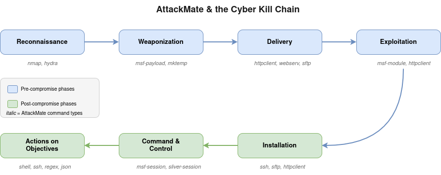
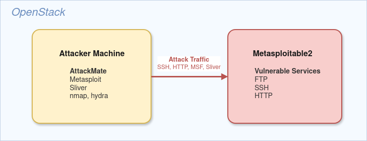

# Module 1: Introduction to AttackMate

## What is AttackMate?

AttackMate is an attack orchestration tool that automates cyber attack scenarios across all phases of the Cyber Kill Chain. Instead of manually typing commands one by one during a penetration test, you define the entire attack chain in a YAML playbook and let AttackMate execute it.

> **Further reading:**
> - [AttackMate Documentation](https://ait-testbed.github.io/attackmate/main/index.html) - full official documentation
> - [AttackMate Command Reference](https://ait-testbed.github.io/attackmate/main/playbook/commands/index.html) - all command types in detail
> - [AttackMate paper on ArXiv](https://arxiv.org/pdf/2601.14108) - *"Realistic Emulation and Automation of Cyber Attack Scenarios Across the Kill Chain"*

### Why use attack automation?

- **Reproducibility**: Run the same attack scenario identically every time
- **Speed**: Execute complex multi-step attacks in seconds instead of hours
- **Documentation**: The playbook itself documents every attack step
- **Chaining**: Automatically pass output from one step as input to the next
- **Integration**: Orchestrate multiple tools (Metasploit, Sliver, SSH, HTTP) from a single playbook

### What can AttackMate do?

| Capability | Command Types |
|---|---|
| Run local commands | `shell` |
| Remote command execution | `ssh`, `sftp` |
| Metasploit integration | `msf-module`, `msf-session`, `msf-payload` |
| Sliver C2 framework | `sliver`, `sliver-session` |
| HTTP operations | `httpclient`, `webserv` |
| Data manipulation | `regex`, `json`, `setvar` |
| Flow control | `loop`, `sleep`, `include` |
| Utility | `debug`, `mktemp` |

### The Cyber Kill Chain

AttackMate can script techniques across all phases of the cyber kill chain:


---

## Lab Environment

The training environment consists of two machines deployed on OpenStack:



**Attacker Machine**: Has AttackMate and all required tools pre-installed.

**Metasploitable2**: A deliberately vulnerable Linux VM with dozens of exploitable services. This is our target for the training. See the [Metasploitable2 documentation](https://docs.rapid7.com/metasploit/metasploitable-2/) for a full list of services and known vulnerabilities.

> **SSH note:** Metasploitable2 uses legacy SSH key algorithms that modern OpenSSH clients reject by default. To connect via SSH manually, you might have to add the following to your `~/.ssh/config`:
>
> ```
> Host <METASPLOITABLE_IP>
>     HostKeyAlgorithms +ssh-rsa,ssh-dss
>     PubkeyAcceptedKeyTypes +ssh-rsa,ssh-dss
> ```
>
> Replace `<METASPLOITABLE_IP>` with your actual Metasploitable2 IP if it differs.

### Verify the Lab Setup

Before starting, verify that your environment works by running these commands on the attacker machine:

```bash
# Check AttackMate is installed
attackmate --version

# Check that you can reach the target (replace with your target IP)
ping -c 1 <METASPLOITABLE_IP>

# Quick nmap scan to verify connectivity
nmap -p 21,22,80 <METASPLOITABLE_IP>
```

### Running AttackMate

```bash
# Run a playbook
attackmate playbook.yml

# Run with debug output (shows variable dumps, detailed execution info)
attackmate --debug playbook.yml

# Run with JSON logging
attackmate --json  playbook.yml
```

---

## Playbook Structure

Every AttackMate playbook is a YAML file with two sections:

```yaml
# Optional: define variables
vars:
  TARGET: 192.168.1.100
  WORDLIST: /usr/share/SecLists/Passwords/darkweb2017-top1000.txt

# Required: list of commands to execute
commands:
  - type: shell
    cmd: nmap $TARGET

  - type: shell
    cmd: hydra -l admin -P $WORDLIST $TARGET ssh
```

### The `vars` Section (optional)

Defines reusable variables as key-value pairs. Variable names do **not** require a `$` prefix when defined, but **must** have `$` when referenced:

```yaml
vars:
  # Both forms are valid when defining:
  TARGET: 192.168.1.100
  $NMAP: /usr/bin/nmap

commands:
  - type: shell
    # $ prefix is required when referencing:
    cmd: $NMAP -T4 $TARGET
```

### The `commands` Section (required)

A list of commands executed **sequentially** from top to bottom. Every command requires at least:
- `type`: which command type to run (e.g., `shell`, `ssh`, `regex`)
- `cmd`: the command content (meaning varies by type, some commands have a default `cmd` value)

### Minimal Playbook

The simplest valid playbook:

```yaml
commands:
  - type: shell
    cmd: echo "Hello from AttackMate"
```

Save this as `hello.yml` and run it:

```bash
attackmate hello.yml
```
