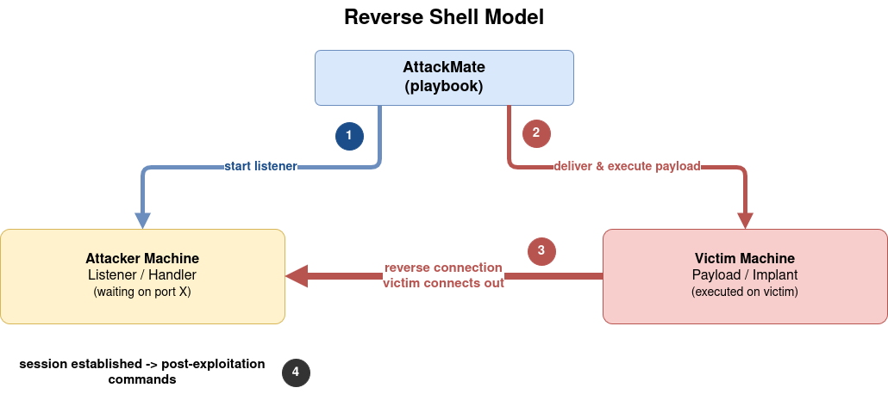
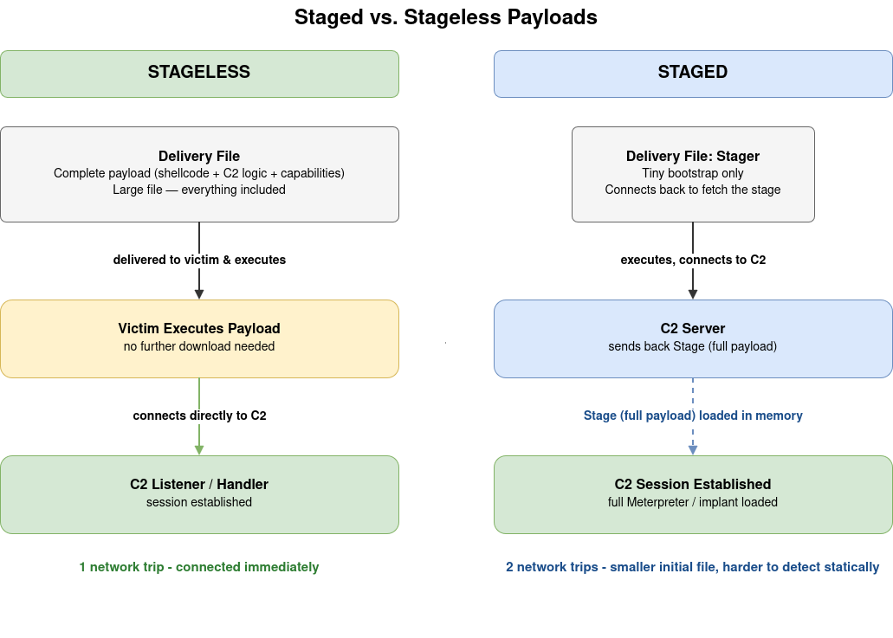
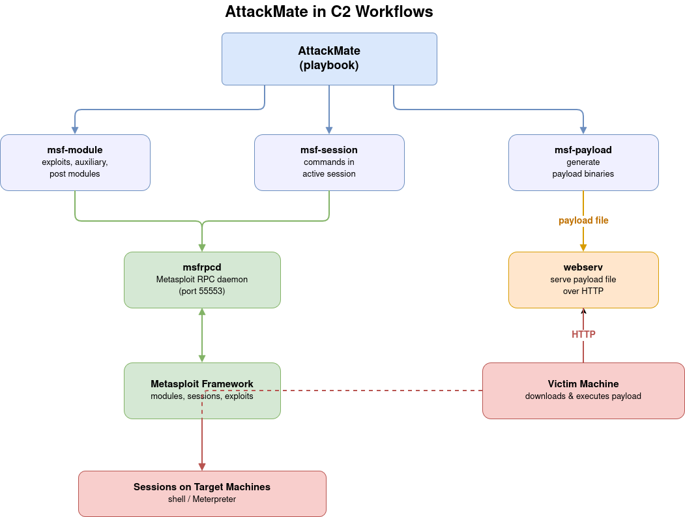

# Module 1: C2 Architecture Concepts

## What is a C2 Framework?

A **Command and Control (C2) framework** is a set of tools that allows an attacker (or red team operator) to maintain persistent access to compromised systems and issue commands to them. The C2 server is the attacker's side; the compromised machine runs an **implant** (also called an agent, beacon, or payload) that communicates back.

C2 frameworks provide:
- encrypted communication channels
- Session management across multiple targets
- Post-exploitation tooling (file transfers, pivoting, credential harvesting)
- Evasion and persistence capabilities

Well-known C2 frameworks used in red teaming include [Metasploit](https://www.metasploit.com/), [Sliver](https://github.com/BishopFox/sliver), Cobalt Strike, and Havoc.

---

## The Reverse Shell Model

A **bind shell** listens on the victim and waits for the attacker to connect. This is rarely useful in real attacks because firewalls typically block inbound connections to victim machines.

A **reverse shell** flips this: the victim connects *out* to the attacker. Outbound connections are far less likely to be blocked, making reverse shells the standard approach.



The key steps in any reverse shell attack:
1. Start a listener on the attacker machine
2. Deliver and execute the payload on the victim machine
3. The victim connects back; the listener accepts and hands off a session
4. Issue post-exploitation commands through the session

AttackMate automates all four steps from a single playbook.

---

## Staged vs. Stageless Payloads

When generating a payload, you choose between two delivery models:



### Stageless

The entire payload (shellcode, communication logic, capabilities) is bundled into one self-contained binary. It is larger but requires no follow-up network connection. One network trip: the payload connects directly to the C2 listener.

### Staged

A small **stager** is delivered first. It connects back to the C2 server and downloads the actual **stage** (the full payload) at runtime. Two network trips: stager connects to C2, C2 sends back the stage, stage loads in memory and establishes the session.

Staged payloads are smaller and harder to detect statically, but they require a working network path from victim to C2 server at execution time.

In Metasploit, the naming convention distinguishes the two: `linux/x86/meterpreter_reverse_tcp` is stageless (underscore), while `linux/x86/meterpreter/reverse_tcp` is staged (slash).

> **Further reading:** [Metasploit payload types](https://docs.metasploit.com/docs/using-metasploit/basics/how-payloads-work.html) explains staged vs. stageless in depth.

---

## What is a "Fully Interactive Shell"?

A **raw reverse shell** is functional but limited. It runs inside a pipe, not a real terminal:

- No job control (`Ctrl+C` kills the shell instead of the current process)
- No tab completion
- No arrow keys / command history
- Programs that require a TTY (like `sudo`, `vi`, `su`) break or refuse to run
- Output can be garbled when programs use terminal escape codes

A **fully interactive shell** has a proper pseudo-terminal (PTY) allocated, so it behaves exactly like a normal SSH session:

```
Raw shell (pipe)               Fully interactive shell (PTY)
--------------------------     ---------------------------------
$ sudo su                      $ sudo su
[sudo] password:               [sudo] password for user:
(hangs / garbled)              Password: ****
                               root@target:#
```

Upgrading a raw shell to a PTY is a standard post-exploitation step. Common methods:
- `python -c "import pty; pty.spawn('/bin/bash')"`
- Metasploit's `shell_to_meterpreter` post module (covered in Module 4)

AttackMate's interactive mode (`interactive: True` on `msf-session` and `ssh` commands) handles the timing and prompt detection needed to reliably send commands to interactive sessions.

---

## How AttackMate Fits into C2 Workflows

AttackMate is an **orchestrator**, not a C2 framework itself. It controls existing tools from a playbook but does not implement its own implant protocol.



What this means in practice:
- AttackMate calls `msf-module` to run an exploit and open a session.
- AttackMate calls `msf-session` to run commands inside that session.
- AttackMate calls `msf-payload` to generate payload binaries.
- AttackMate can use `webserv` to serve those binaries to victims.
- The actual C2 communication (the Metasploit session) is handled by Metasploit itself; AttackMate just orchestrates it.

The same pattern applies to Sliver: AttackMate generates implants and interacts with Sliver sessions, but the C2 channel itself runs inside the Sliver server.
